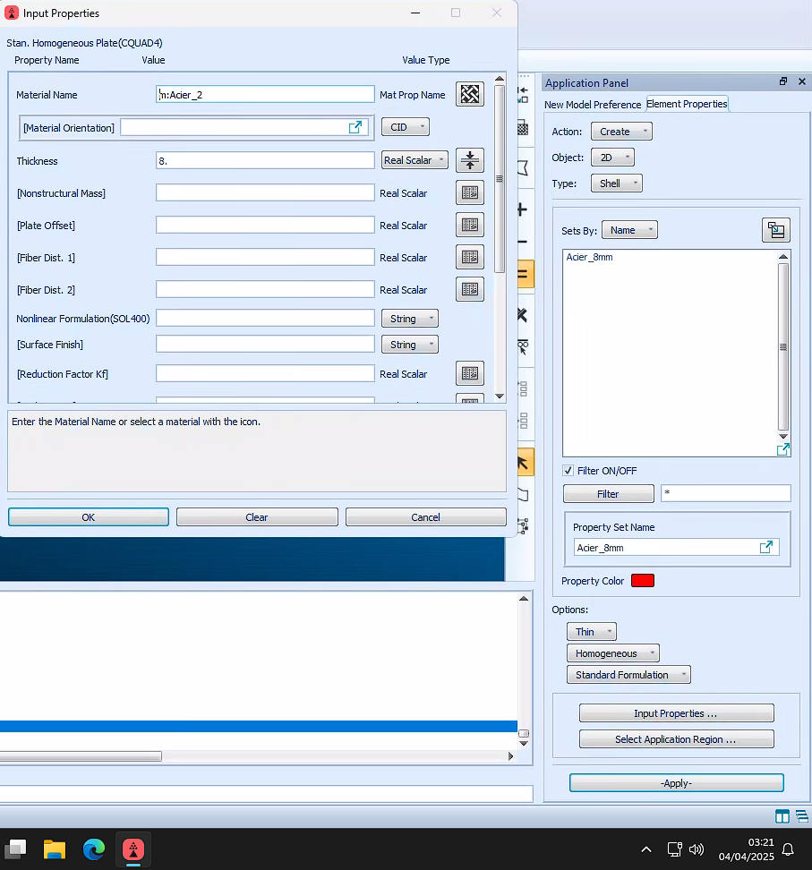

# Pour faire un portique:

1. Geometry > Points > Regarder sur la droite, et avoir méthode Create / Point / XYZ, puis décocher Auto Execute  
2. Inscrire les coordonnées dans "Point coordinates list"  
3. Pour mieux visualiser les points => Home / Misc / Point size (deux points bleus)  

---

Si un point ne va pas, pas de soucis, il suffit de changer Action de "Create" a "Delete". Si on clique sur un point, il apparaîtra dans le menu à droite, et on pourra choisir de le supprimer

---

Home / Misc / Label Control / Point ou Curve, permet de vérifier l'absence de doublons. Si ya doublon, penser à delete la curve (même méthode que pour le point).

Si on delete, penser à "Reset Graphics" (petit balais en haut à gauche) pour réinitialiser la vue.

---

On peut visualiser les noeuds en faisant Home / Misc / Node size (deux petits carrés). Ca permet de mieux voir, et de mieux sélectionner les noeuds. C'est pratique pour la vérification.
Faire aussi Home / Misc / Label Control / Node & Elements pour afficher les noeuds et les éléments.

---

distance en mm, MPa et N
Shear Modulus auto calculé par Patran, pas besoin de le mettre. Formule avec le Elastic Modulus et le Poisson's ratio: 

G = E / (2 * (1 + v)) (askip)

Après si on a 2 des données, Patran peut calculer la 3ème tout seul.

Densité en Tonne par mm^3, attention à la conversion. Cela vient des unités de la géométrie (mmn, N, MPa)

---

Un peu plus technique lui.
On va dans Properties / 1D Properties / Beam
Sur le menu à droite, on a Create / 1D / Beam. On met un nom à la propriété (être le + explicite possible, ne pas mettre d'accents ou d'espaces)
Ensuite, on clique sur "Input Properties", et on clique sur "Create Beam Section" ou un truc du genre (big bouton en bas).

On aura la beam librairie (capture d'écran), et dessus on cherche le rectangle plein, on met ensuite les bonnes valeurs et on donne un nom à la section en plus. On clique sur "Calculate/Display".
Ca permet de vérifier les infos qu'on a mis, et de voir si ya pas de soucis. 

Dans la vue à gauche avec la poutre coupée, on voit 4 lettres, C D E F (dans le sens horaire). C'est les 4 points sur lesquels on aura des datas, c'est utile à savoir pour la suite. On a aussi bcp d'infos sur la section, comme le moment d'inertie, le centre de gravité, etc.

Une fois les vérifications faites, on ferme avec la croix rouge la fenetre avec la section + datas, et on clique sur "OK" pour valider la section.

Mettre les bons paramètres (voir indications sur la capture d'écran).
On appuie enfin sur OK, et on clique sur Select Application Region.

Une fenetre apparait sur la droite, et même méthode que tout à l'heure, shift click/grande sélection pour sélectionner toute les courbes. CLIQUER SUR ADD, puis Ok, puis on peut enfin apply. On a un message dans la console indiquant le succès.

---

Désolé c'est une photo, mais en gros, faut aller sur Display, Load/BC/Elem. Props... et ensuite changer le 1D en 3D full span. Ensuite on Apply et le portique devient plus gros (jsp comment dire autrement).

ENSUITE pour visualiser si la section est bien => Home / Orientation / Iso. Si ya un écart aux intersections, c'est normal

On peut ensuite retourner sur Display, Load/BC/Elem. Props... et changer le 3D full span en 1D. C'est une étape de check qu'on a fait, mais elle ne sert pas à autre chose que de vérifier qu'on a bien setup

---

Suivre infos du screen, et mettre ok puis select application region. On sélectionne ensuite le point de la base là, tout en bas, et on clique sur add, puis ok, puis apply. On devrait visualiser sur le point des petites fleches bleues.

On créé la force et on met les bonnes valeurs. On peut laisser moment vierge, et on fait ok. Ensuite, Select Application Region, on sélectionne le point de la poutre que j'ai entouré, et on fait add, ok, apply. On a un message de succès dans la console.
On voit une fleche apparaitre avec la force appliquée, signe que c'est bien fait.

Même méthode, mais autre nom de force + autres valeurs + autre point. On fait ok, select application region, on sélectionne le point de la poutre que j'ai entouré, et on fait add, ok, apply. On a un message de succès dans la console.

On peut visualiser en 2D qu'on a fait du bon travail

Suivre les étapes (entire model, puis subcases, puis output requests puis Element forces).
Ensuite, ok, apply, cancel (oui oui, c'est pas une blague), puis apply enfin.

Une fenetre de commande en mode terminal apparait, on attend juste. Quand elle ferme, on va chercher le résultat.
Pour la chercher, on va charger le résultat Patran, voir photo en dessous.

Ensuite OK une fois le fichier sélectionné, puis apply, et check qu'un truc soit apparu dans la zone de commande. IL FAUT que y'ait end: attach result file, sinon ca veut dire ya eu un pb avant

Sélectionner les bons fringe result et deformation result.
Si le texte et tout sur le modèle ca fait chier => toggle spectrum.

C'est pas super lisible => faire comme dans l'image suivante:

## Analyse des résultats etc...

Sur la photo avec fringe result & deformation result, on peut changer "Magnitude" pour voir les résultats en fonction de la direction. 

Pour visualiser + d'infos, on change de catégorie => Result puis avoir Create / Marker / Scalar, puis sélectionner Displacement, Translational, puis Apply.
On a à nouveau l'histoire de Magnitude, composante X, Y, Z... 

---

Autre méthode:
Via Label, trouvver les points intéressants.
Ouvrir avec Notepad++ le fichier .f06, et chercher les points intéressants. Il faut chercher par catégorie, par exemple "Displacement Vector" et on a bcp d'infos.
C giga chiant je fais pas de captures d'écran c 2h43 du mat, mais en gros ya tout, les données précises etc... Juste 0 interface utilisteur, c chiant à lire, mais c'est le moyen que les profs utiliseront de ce que j'ai capté.

Si on regarde des rotationnal, c'est du radian, pas du degré.
T1 T2 T3 désignent les 3 translations, et R1 R2 R3 les 3 rotations. 

A regarder: constraint forces translationnal & displacement translationnal, sur magnitude etc...
constraint forces rotationnal & displacement translationnal, sur magnitude etc...
Dans marker et dans juste l'observation normale

On peut mettre Bar stresses axial, et c'est les contraintes normales de la poutre dues à la traction compression. 
Bar stresses bending, et c'est les contraintes de flexion.
Maximum Combine, jsp ce que c'est, mais c'est un mélange des 2.

Sur le fichier .fo6, faut regarder "Stresses in bar elements (cbar)". On a, par élément, SA1, SA2, SA3, SA4, Axial Stress, SA Max, SA Min. SA1, SA2, SA3, SA4 sont les contraintes de flexion, et Axial Stress c'est la contrainte normale.
SA Max et SA Min c'est les contraintes maximales et minimales de flexion. (de ce que j'ai compris).

---

Bar Forces, Translational permet de voir les efforts normaux, en vérification. En Rotationnal aussi on peut check nos datas. 

# Pour faire une poutre:	

D'abord faire toute la théorie encore. Courage.

On fait Home / Orientation / Celle tout en haut à droite pour être en vue de côté en gros (y vers le haut, z vers la droite, x vers l'arrière).

Geometry, on retire l'auto execute, on met ensuite les points.

Ici on a eu les points aux coordonnées:

- 0,0,0
- 0,0,188.5
- 0,71,188.5
- 0,71,0

Ensuite Geometry, select curve, et on fait un U comme figure.

Une fois le U fait, on clique sur Geometry, selectu surfaces, extrude. On aura Create / Surface / Extrude. On change translation vector de 0,0,1 à 5000,0,0. On fait Curve List et on sélectionne le U. Ensuite Apply. On a un message dans la console qui dit si c'est une réussite.

---

Home ensuite orientation iso pour voir la poutre. Misc / Label et surface pour voir les 3 surfaces apparaitre. SI ya des surplus, on peut delete les surfaces en trop.

---

On met les mêmes trucs que sur l'image. Ici on a changé Automatic Calculator pour mettre 24 au lieu de genre 76. 
Dans Label, si on met élément, on aura 1 nombre par élément.

---

On créé un nouveau matériau, et on met les bonnes valeurs. On fait Apply, et on a un message de succès dans la console. Voir image pour les valeurs etc...

ENSUITE Properties / 2D Properties / Shell
Copier valeurs de la photo dans input properties, penser à mettre un nom explicite. Appliquer seulement sur LA SURFACE concernée. Ici c'est la surface du bas. Ne pas appliquer sur les carrés mais sur la surface entière.

---

Pour visualiser que c'est bien fait => Changer de create à Show, et choisir thickness. On devrait voir 1 couleur / épaisseur.

Ensuite on va dans loads/bc et on créé un displacement contraint. On met les bonnes valeurs (capture d'écran), ok puis on sélectionne la bonne géométrie. 

---

On met l'encastrement sur la bonne extrémité (sélectionner les segments de la poutre concernés)

On créé un nouveau displacement contraint, et on met les bonnes valeurs. On sélectionne les bons segments (de l'autre côté de la poutre). On fait apply, et on a un message de succès dans la console.

---

On fait un CID Distributed Load, avec les valeurs écrites dans la capture d'écran. Il faut penser à mettre 2D au lieu de 3D dans Target Elementt Type. On l'applique au bon endroit, c'est à dire sur la longueur de la poutre sur les 2 segments du U. On fait apply, et on a un message de succès dans la console.

---

## Analyse des résultats

Même méthodologie que pour le portique, on va dans Display, Load/BC/Elem. Props... et ensuite changer le 1D en 3D full span. Ensuite on Apply et le portique devient plus gros (jsp comment dire autrement).

Fin bref, j'épargne les détails.

# Formules à retenir:

Voici les principales formules pour étudier une **poutre** et un **portique** en statique, avec leurs noms et unités :

---

### **1. Efforts internes (Poutres et Portiques)**
#### **Effort normal (N)**  
- **Formule** : \( N = \sum F_{\text{axiales}} \)  
- **Unité** : Newton (N) ou kN  
- **Signe** :  
  - **Traction** : \( N > 0 \)  
  - **Compression** : \( N < 0 \)  

#### **Effort tranchant (V ou T)**  
- **Formule** : \( V = \sum F_{\text{transversales}} \) (à gauche ou à droite d'une section)  
- **Unité** : Newton (N) ou kN  

#### **Moment fléchissant (M)**  
- **Formule** : \( M = \sum (\text{Couples ou moments externes}) + \sum (F \times d) \)  
  - \( d \) = distance perpendiculaire à la force  
- **Unité** : Newton-mètre (N·m) ou kN·m  
- **Convention** :  
  - **Moment positif** : Fibres inférieures tendues (poutre simplement appuyée)  

---

### **2. Relations différentielles (Poutres)**
Ces relations relient \( q \), \( V \) et \( M \) :  
1. **Charge répartie \( q \) → Effort tranchant \( V \)**  
   \[
   \frac{dV}{dx} = -q(x)
   \]  
2. **Effort tranchant \( V \) → Moment \( M \)**  
   \[
   \frac{dM}{dx} = V(x)
   \]  
3. **Charge \( q \) → Moment \( M \) (dérivée seconde)**  
   \[
   \frac{d^2M}{dx^2} = -q(x)
   \]  
- **Unités** :  
  - \( q \) : N/m ou kN/m  
  - \( V \) : N ou kN  
  - \( M \) : N·m ou kN·m  

---

### **3. Contraintes (Poutres)**
#### **Contrainte normale \( \sigma \) (flexion pure)**  
\[
\sigma = \frac{M \cdot y}{I}
\]  
- **Unités** :  
  - \( \sigma \) : Pascal (Pa) ou MPa  
  - \( M \) : N·m  
  - \( y \) : distance depuis l'axe neutre (m)  
  - \( I \) : Moment d'inertie (m⁴)  

#### **Contrainte de cisaillement \( \tau \) (effort tranchant)**  
\[
\tau = \frac{V \cdot Q}{I \cdot b}
\]  
- **Unités** :  
  - \( \tau \) : Pa ou MPa  
  - \( Q \) : Moment statique de la section (m³)  
  - \( b \) : Largeur de la section (m)  

---

### **4. Flèche des poutres**
#### **Équation différentielle de la déformée**  
\[
EI \frac{d^2v}{dx^2} = -M(x)
\]  
- **Unités** :  
  - \( E \) : Module d'Young (Pa)  
  - \( I \) : Moment d'inertie (m⁴)  
  - \( v \) : Flèche (m)  

#### **Solutions courantes** (conditions aux limites dépendantes) :  
- **Poutre simplement appuyée avec charge uniforme \( q \)** :  
  \[
  v_{\text{max}} = \frac{5qL^4}{384EI}
  \]  

---

### **5. Portiques (Méthode des rigidités ou des forces)**
#### **Équilibre global**  
\[
\sum F_x = 0, \quad \sum F_y = 0, \quad \sum M = 0
\]  
- **Unités** : Forces (N), Moments (N·m)  

#### **Méthode des forces (pour les portiques hyperstatiques)**  
- **Formule générale** :  
  \[
  \delta_{ij} + \sum (R_k \cdot \delta_{ik}) = 0
  \]  
  où \( \delta_{ij} \) est le déplacement dû à la charge, et \( R_k \) sont les réactions hyperstatiques.  

---

### **6. Moments d'inertie (Section transversale)**  
#### **Rectangle (largeur \( b \), hauteur \( h \))**  
\[
I = \frac{b h^3}{12}
\]  
- **Unité** : m⁴ ou cm⁴  

#### **Cercle (diamètre \( D \))**  
\[
I = \frac{\pi D^4}{64}
\]  

---

### **Résumé des unités**  
| Grandeur       | Unité SI        | Autres unités courantes |  
|----------------|-----------------|-------------------------|  
| Effort normal  | Newton (N)      | kN                      |  
| Effort tranchant | Newton (N)    | kN                      |  
| Moment fléchissant | N·m         | kN·m                    |  
| Charge répartie | N/m            | kN/m                    |  
| Contrainte      | Pascal (Pa)     | MPa (1 MPa = 10⁶ Pa)     |  
| Module d'Young  | Pa              | GPa (1 GPa = 10⁹ Pa)     |  
| Moment d'inertie | m⁴            | cm⁴                     |  

---

Voici un tableau récapitulatif des matériaux de construction remarquables (aciers, béton, bois, etc.) avec leurs **modules d'Young (E)** et **coefficients de Poisson (ν)** :

---

### **Tableau des propriétés mécaniques des matériaux**
| Matériau                     | Module d'Young \( E \) (GPa) | Coefficient de Poisson (ν) | Remarques                                  |
|------------------------------|-----------------------------|----------------------------------|--------------------------------------------|
| **Aciers de construction**   |                              |                                  |                                            |
| Acier S235 (Euronorm)        | 210                         | 0.3                              | Acier standard, usage général              |
| Acier S355                   | 210                         | 0.3                              | Plus résistant que S235                    |
| Acier à haute résistance     | 200 – 210                   | 0.3                              | Ex : S450, S700                            |
| Acier inoxydable (304)       | 193 – 200                   | 0.29 – 0.31                      | Résistance à la corrosion                  |
| **Béton**                    |                              |                                  |                                            |
| Béton C20/25                 | 25 – 30                     | 0.15 – 0.2                       | Béton courant                              |
| Béton C30/37                 | 30 – 35                     | 0.15 – 0.2                       | Béton armé standard                        |
| Béton haute performance (BHP)| 40 – 60                     | 0.2 – 0.25                       | Résistance accrue                          |
| **Bois**                     |                              |                                  |                                            |
| Bois résineux (pin, sapin)   | 8 – 12                      | 0.3 – 0.4                        | Direction parallèle aux fibres             |
| Bois dur (chêne)             | 10 – 15                     | 0.3 – 0.45                       | Anisotrope : \( E \) varie selon la direction |
| **Aluminium**                | 68 – 72                     | 0.33 – 0.35                      | Léger, utilisé en structures aéronautiques |
| **Verre**                    | 50 – 90                     | 0.18 – 0.25                      | Fragile, faible ductilité                  |
| **Titane**                   | 100 – 120                   | 0.33 – 0.36                      | Résistant et léger (médical, aérospatial)  |
| **Polyéthylène (PEHD)**      | 0.8 – 1.4                   | 0.4 – 0.45                       | Plastique, faible rigidité                 |

---

### **Notes :**
1. **Unités** :  
   - Module d'Young \( E \) : Gigapascal (**GPa**) (1 GPa = 10⁹ Pa).  
   - Coefficient de Poisson (ν) : Sans dimension (compris entre 0 et 0.5).  

2. **Variabilité** :  
   - Les valeurs dépendent des nuances (ex : aciers), de l’humidité (bois), ou du vieillissement (béton).  
   - Le béton est **hétérogène** : \( E \) augmente avec la résistance à la compression.  

3. **Coefficient de Poisson** :  
   - Caractérise la contraction transversale sous traction.  
   - Ex : ( ν = 0.3 ) → Si un acier s’allonge de 1 mm, il se rétrécit de 0.3 mm.  

---

### **Exemple d'application :**  
Pour calculer la **déformation axiale** \( \epsilon \) d’une poutre en acier S235 soumise à une traction, on utilise la formule suivante :  
$\epsilon = \frac{F}{A \cdot E} = \frac{σ}{E}$

où :
- \( F \) est la force de traction (en newtons, N),
- \( A \) est la section transversale de la poutre (en mètres carrés, m²),
- \( E \) est le module d’élasticité de l’acier S235, soit \( E = 210 \times 10^9 \, \text{Pa} \).

> Remarque : Assurez-vous que les unités sont cohérentes (N, m², Pa) pour que \( \epsilon \) soit sans unité (c’est une déformation relative).

---

1 Gpa = 10^3 N/mm²
1 Gpa = 10^6 Pa
1 Gpa = 10^9 N/m²
1 bar = 10^5 Pa
1 bar = 0.1 MPa
1 MPa = 10^6 Pa
1 MPa = 10 bar
1 MPa = 10^3 kPa
1 kPa = 10^3 Pa
1 kPa = 0.01 bar
1 kPa = 0.001 MPa